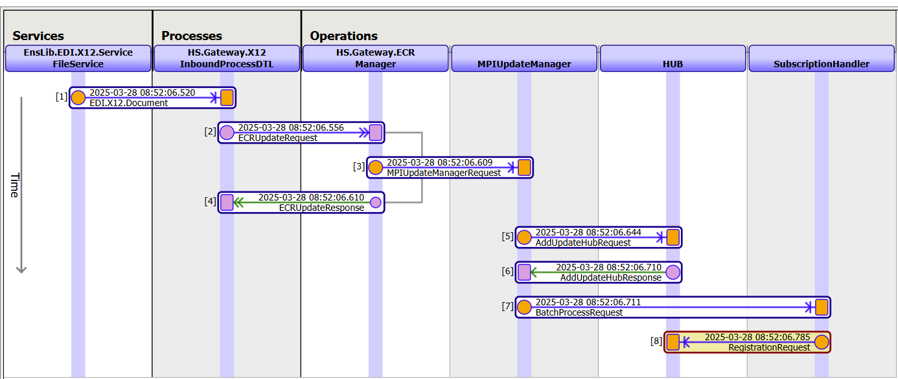

# Module 1 Exercise 3 -  Running a Demo X12 837I into SDA in EDGE Gateway + Walking through the Message Trace

**Task:** 

## Instructions:

Navigate to the same Production as Exercise 2.

Click on the EnsLib.EDI.X12.Service.FileService; this is where we will send our example X12 file. In the settings tab, under basic settings, find the File Path that is connected to this service.

Navigate to /tmp/x12/infolder/ and copy the file 837Ix12example01.txt. Paste the copied file into the in-folder connected to the EnsLib.EDI.X12.Service.FileService.

Return to the EdgeGatewayProduction, click on the EnsLib.EDI.X12.Service.FileService, and navigate to the messages tab. Click on the header number next to the top message to pull up the message trace. 

You should see something like this: 

In this trace, the X12 file is being sent to the Inbound Process DTL where it is transformed into SDA3. The information is eventually sent over to update the ODS FHIR server (step 5) and in the AddUpdateHubResponse (step 6) you can see the unique patient MPIID that we will use to retrieve the FHIR bundle.

### Task 1: 

Find the following in step 5 and step 6 of the trace:

1. Patient first name
2. Facility
3. Date of Birth
4. MPIID

### Task 2: Reviewing the SDA Result

1. Use the SQL Queries covered in the previous exercise to inspect the SDA Streamlets for the Medical Claims. 
