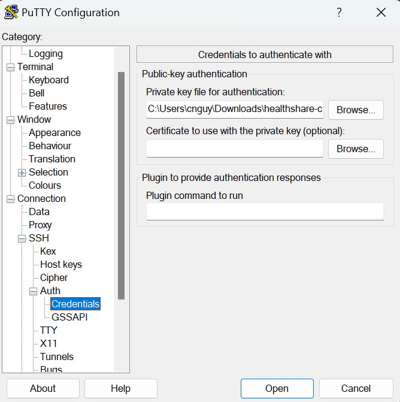
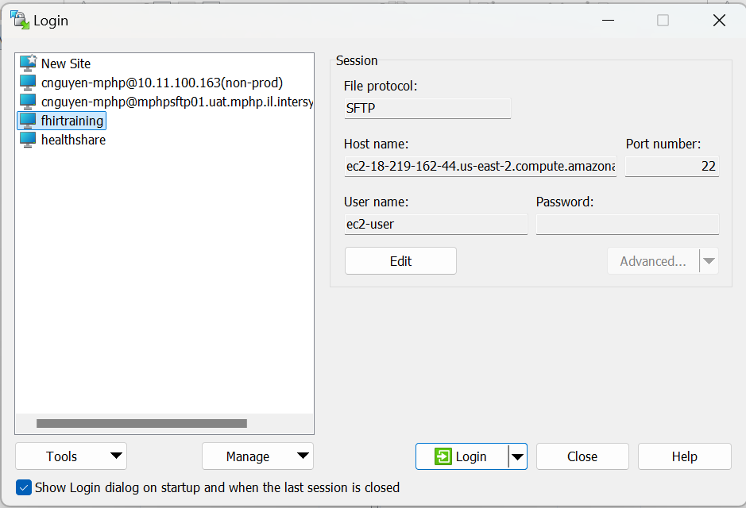
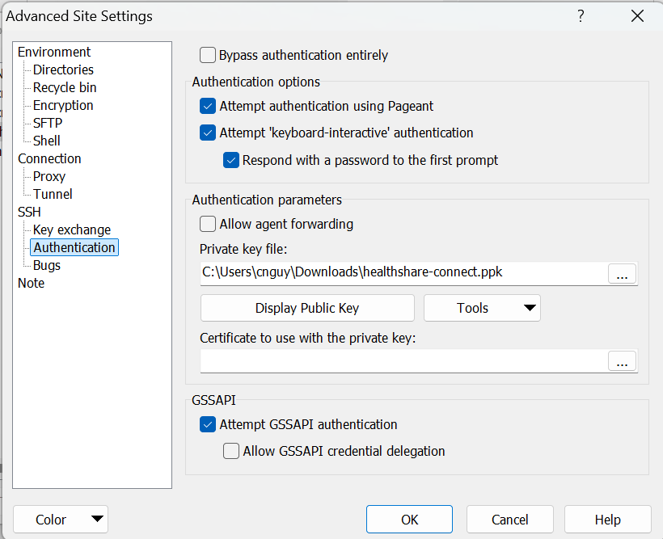

# Module 4 Exercise 0 - Getting Set Up for Working in the Training Environment

We will be working in a training instance of IRIS for Health. In order to work in the environment, you will need to set up Visual Studio Code, Putty, and WinSCP. 

Download and install these applications if you have not already done so: 
* Visual Studio Code:
* Putty:
* WinSCP:

## Instructions:

### Set up Visual Studio Code: 

1. Open Visual Studio Code.
2. Go to the **Extensions** tab (or press `Ctrl+Shift+X`).
3. In the search bar, type `InterSystems` and install these extensions. 
   - **InterSystems**
   [InterSystems Server Manager](https://marketplace.visualstudio.com/items?itemName=intersystems-community.servermanager)

   [InterSystems Lanuage Server](https://marketplace.visualstudio.com/items?itemName=intersystems.language-server)

   [InterSystems ObjectScript](https://marketplace.visualstudio.com/items?itemName=intersystems-community.vscode-objectscript)

   [InterSystems ObjectScript Pack](https://marketplace.visualstudio.com/items?itemName=intersystems-community.objectscript-pack)

4. In the search bar, type `FHIR` and install the following:
   - **FHIR Tools**  
     [FHIR Tools Extension](https://marketplace.visualstudio.com/items?itemName=metahorizon.vscode-fhir-tools)
   - **FHIR JSON Tooling**  
     [FHIR JSON Tooling Extension](https://marketplace.visualstudio.com/items?itemName=metahorizon.fhir-json-tooling)

Follow the instructions in the Setting Up Visual Code For IRIS Development document to connect to the training environment. 

## Setting up Putty

1. Open Putty
2. Enter the following parameters:
    * Hostname: ec2-18-219-162-44.us-east-2.compute.amazonaws.com
    * Port: 22
    * Saved Session: fhirtraining
3. Click **Save**.
4. In the left-side panel, select **Connections->SSH->Auth->Credentals**
5. Under **Private Key for Authentication** select 'Browse'. Enter the path to the private key provided to you for connection. 

6. Click back on **Session** in the left-side panel. Click Save to save the **fhirtraining** session. 
7. Click **Open** to open a terminal. 
8. You only need to enter a username: **ec2-user** and no password to login. 

## Setting Up WinSCP

1. Open WinSCP
2. Set up a profile called **fhirtraining** with the same parameters: 
    * Hostname: ec2-18-219-162-44.us-east-2.compute.amazonaws.com
    * Port: 22
    * Username: ec2-user (no password)
3. Set up the private key in the **Advanced** button. 

Setting the Private Key: 

