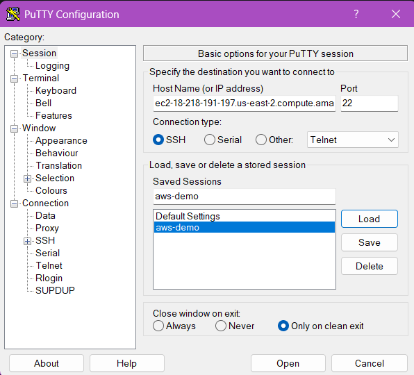
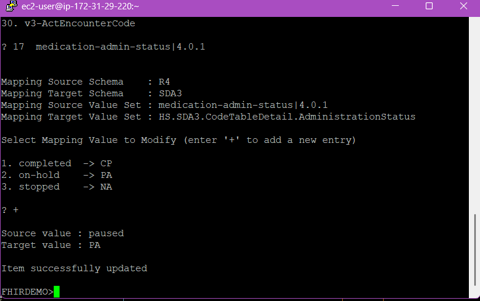

# Module 6 Exercise 1 - FHIR Terminology

**Task:** 

## Instructions:

Task 1

Navigate to FHIR Terminology page. The path to do this is by clicking on Health -> Schema Documentation -> FHIR Annotations. 

Once on this page click on the **View Lookups** button. This will open a window that shows you the existing FHIR Terminology transforms that are currently being applied. 

We will be referring back to this page as we move forward with the exercise.

Task 2

Download healthshare-connect.ppk from the exercise-1 folder. 

Inside of Putty navigate to the following location:
    Connections -> SSH -> Auth -> Credentials

Set the Private Key for Authentication the healthshare-connect.ppk you downloaded.

Navigate back to Connections.
Set the following:
    Host Name: ec2-18-219-162-44.us-east-2.compute.amazonaws.com
    Port: 22
    Connection Type: SSH

Now that we have Putty access we can run the script to update a entry in the FHIR Terminology Lookup tables. 

To do so we first need to open Putty, start IRIS terminal, and enter the correct namespace.

Enter the following as your user:
ec2-user

It will then prompt you for a user name and password.
Username: _system
Password:SYS

Run the next command to enter into a iris terminal session:
iris terminal irishealth

We then need to change into your namespace.
ZN "*YOUR-NAMESPACE*"

And then we can run the script to actually edit the FHIR LookUp Tables. The script itself will prompt you and tell you what options you have for every step.
 do ##class(HS.FHIR.DTL.Util.API.LookupTable).EditLookupTable()

We are transforming from FHIR R4.
 R4

We will end up in SDA.
 SDA3

Instead of having to type out an entire field name we can just enter the number associated with the field. Here we are going to be updating the MedicationAdminStatus.
 17

You can edit an existing value or add a brand new one. For this exercise we are adding a new one.
 +

We will be mapping the value paused to PA.
 paused
 PA

 After the prompts finish Navigate back to FHIR Annotations. 

 Try going through the process on your own and updating an existing mapping instead of adding a new one.git 